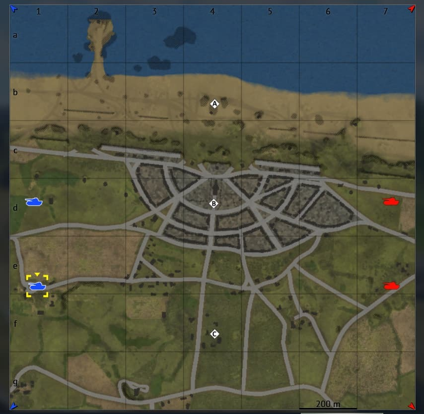
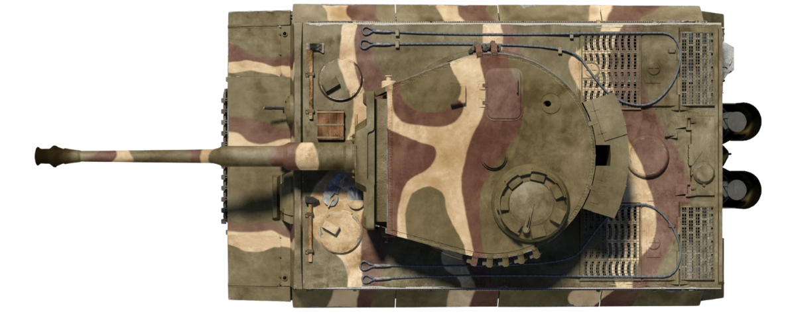
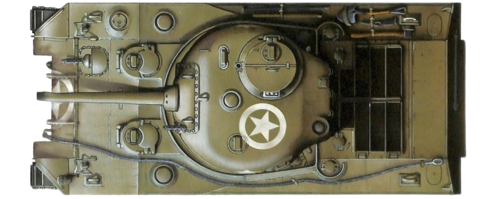
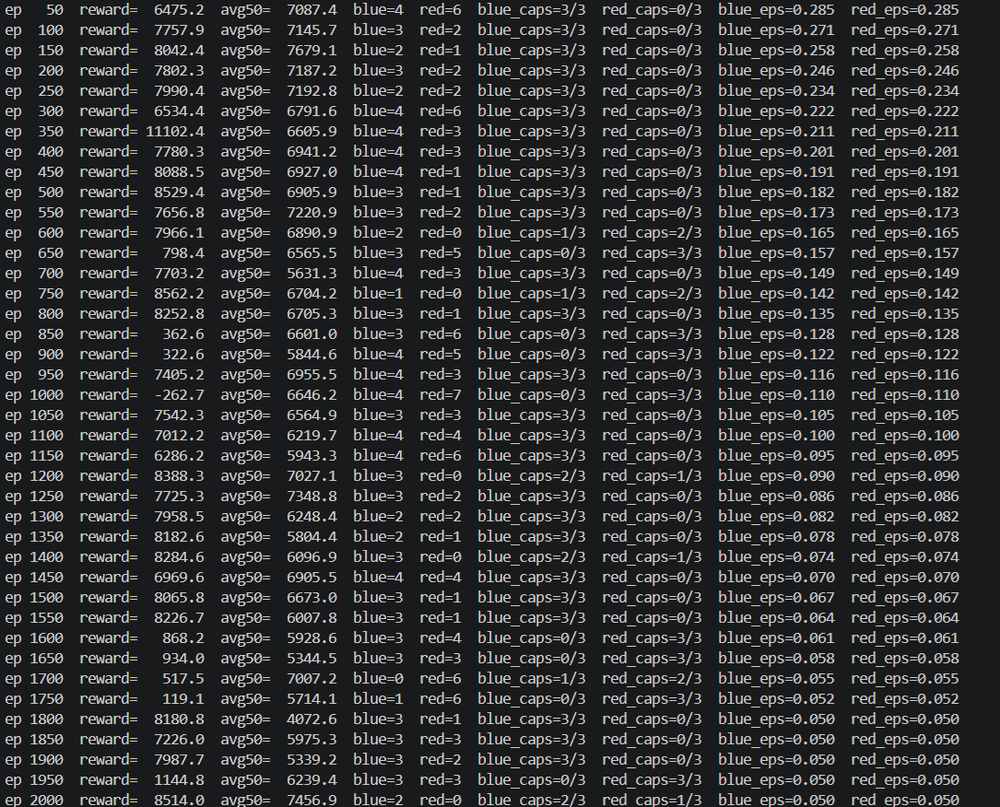
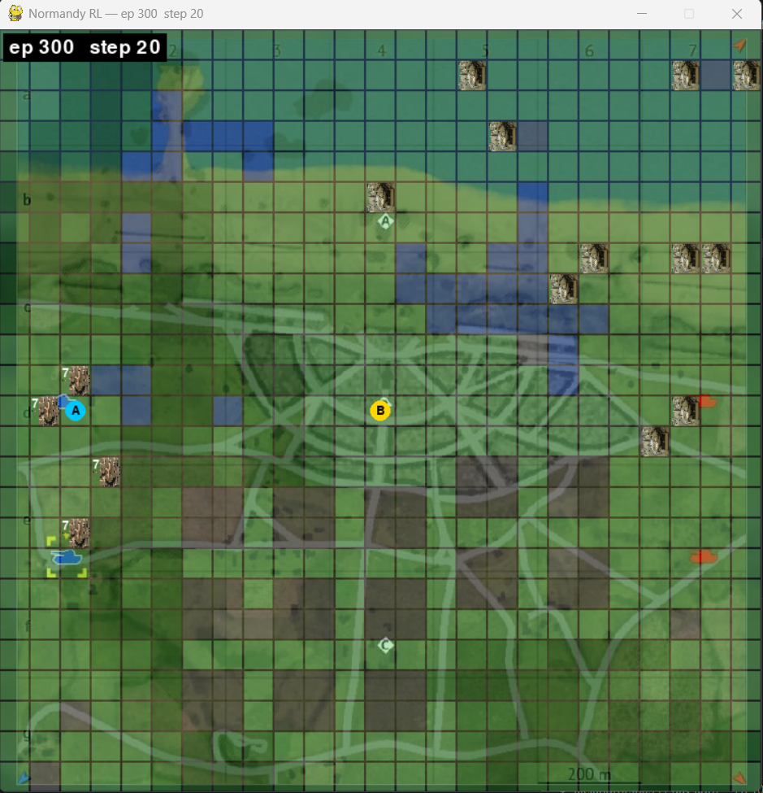
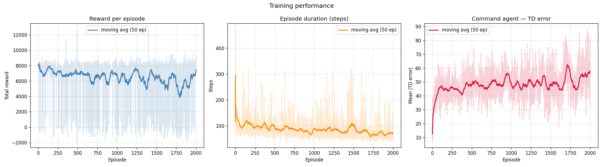
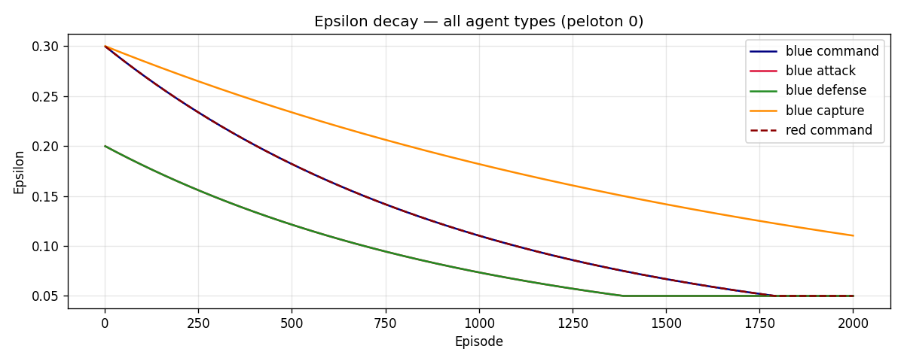
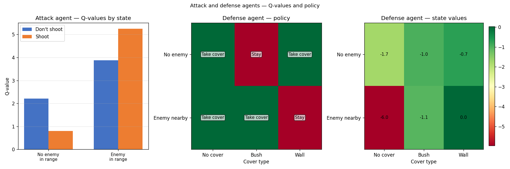
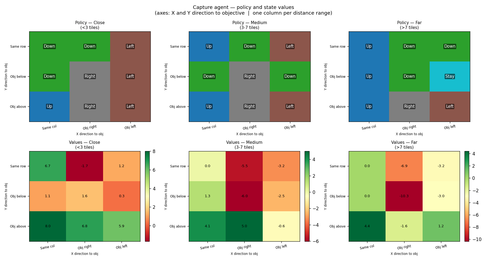
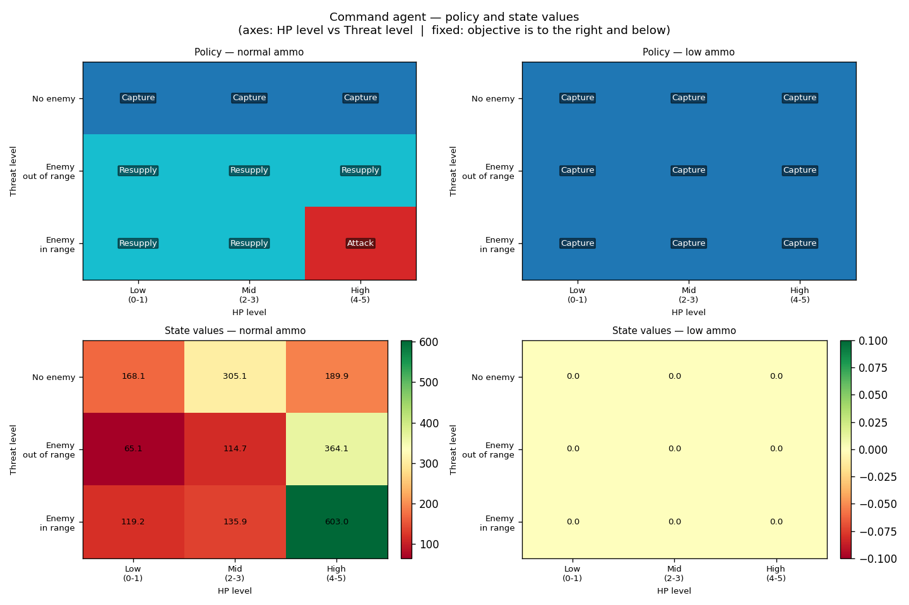

**IA-Normandy – Normandy Battle Simulation with RL**

Artificial Intelligence course project. Multi-agent tactical simulation of the Battle of Normandy implemented using Gymnasium and tabular Q-Learning.

----------------------------------------------------

**Table of Contents**
   - Description
   - Multi-Agent Architecture
   - Project Structure
   - Environment
   - Installation 
   - Usage
   - Results
   - Future Work
   - Authors

----------------------------------------------------

**Description**
IA-Normandy is a tactical simulation of the Battle of Normandy (and later the Battle of Caen) in a 2D grid environment of 25x25 cells. The project models a historically accurate numerical imbalance: the blue team (Germans, Tigers) starts at a 1:3 disadvantage against the red team (Allies, Shermans), but compensates with greater armor and firepower per unit.

The objectives of the blue team are:
   - Capture and hold points of interest A, B, and C (with B being the most strategically valuable).
   - Engage the enemy while taking advantage of terrain cover.

Learning is carried out using tabular Q-Learning, with a hierarchical structure of agents that make decisions at different levels of abstraction.

----------------------------------------------------

**Multi-Agent Architecture**
The system is organized into two hierarchical levels:
   - Commander Agent: Coordinates the platoon’s sub-agents. Receives the mission from the Marshal and executes it.
   - Attack Agent: Decides whether to attack the nearest enemy within its observation range. It is penalized if an enemy is present and it     does not fire; it is rewarded for each successful hit.
   - Capture Agent: Moves the platoon toward the designated objective. It is rewarded for getting closer and penalized for moving away.
   - Defense Agent: Manages the defense of already captured points. Coordinates the platoon’s defensive positioning when assigned to hold an objective.

----------------------------------------------------

**Environment**
Map and Terrain
The environment is a 25x25 grid rendered with Pygame, using mapaNormandia.png as the background. Obstacles are generated procedurally and randomly in each episode.

Sample of the map used

Cell type              Cover          Movement penalty         Description
OPEN                    0.0                  0                 Open terrain with no cover
BUSH                    0.3                  1                 Bushes, light cover
FOREST                  0.6                  2                 Forest, moderate cover
RUBBLE                  0.5                  1                 Debris, good cover
WALL                    0.9                  3                 Wall, high cover
WATER                   0.0                  99                Water, impassable 

**Points of interest**
Point              Strategic Value            Notess
  A                    Medio                  Allows supply collection (limit: 1000 fuel, 50 ammo)
  B                    Alto                   The most valuable due to its central position
  C                    Medio                  Same as A

**Platoons**
Team            Platoons         Tanks/Platoon      HP/Platoon              Image
Blue (Tigers)        4                    7                 700       
Red (Shermans)   12(3:1)                 3                 300       

When HP drops below 100, a tank is destroyed and the platoon’s firepower decreases proportionally.

**Commander Meta-Actions (per platoon)**
Meta-Action           Code              Delegated Sub-Agent
META_CAPTURE           0                Capture Agent – Moves toward the objective
META_ATTACK            1                Attack Agent – Decides whether to fire
META_DEFENSE           2                Defense Agent – Seeks cover
META_RESUPPLY          3                Resupply – Directly at supply point

**Observation Vector (per platoon)**
Each platoon receives a vector of 16 integer values in the range [0–9]:
0     hp_hundreds    0-5      Platoon HP in hundreds
1     fuel_level     0-5      Fuel level (fuel // 20)
2     ammo_level     0-5      Ammunition level (ammo // 20)
3     num_tanks      0-5      Remaining operational tanks
4     cover_type     0-2      Type of cover in the current cell
5     enemy_nearby   0-1      Enemy within <= 4 cells
6     enemy_dist     0-9      Distance to the nearest enemy
7     captured_A     0-1      Punto A captured by blue
8     captured_B     0-1      Punto B captured by blue
9     captured_C     0-1      Punto C captured by blue
10    obj_dx_dir     0-2      X direction to the objective (0 = same, 1 = right, 2 = left)
11    obj_dy_dir     0-2      Y direction to the objective (0 = same, 1 = down, 2 = up)
12    obj_dist       0-9      Manhattan distance to the objective
13    sector_x       0-4      Map sector in X (pos // 5)
14    sector_y       0-4      Map sector in Y (pos // 5)
15    low_ammo       0-1      Critical ammo flag (<20)

**Available actions (per platoon)**
Action            Code              Description
MOVE_NORTH          0               Move north
MOVE_SOUTH          1               Move south
MOVE_EAST           2               Move east
MOVE_WEST           3               Move west
ATTACK_NEAREST      4               Attack the nearest enemy in range
TAKE_COVER          5               Seek an adjacent covered cell
RESUPPLY            6               Resupply if in the base zone
HOLD_POSITION       7               Hold position and wait

----------------------------------------------------

**Gymnasium Wrappers**
Wrappers allow us to add functionality to the base environment without modifying its code. They are stacked in layers on top of the environment, so that each one transforms observations, actions, or metrics before they reach the agent or the training loop.

We have used the following:
   - FogOfWarWrapper: Hides enemies beyond 8 cells. Simulates the historical fog of war.
   - ActionMaskWrapper: Prevents invalid actions (attacking without ammo, resupplying outside supply points). Automatically redirects to     META_CAPTURE.
   - TimeLimit: Limits each episode to a maximum number of steps (default: 500).
   - EpisodeStatsWrapper: Sliding window over the last 100 episodes
         Average reward, average steps, and average captures
   - ObsNormWrapper: Normalizes the observation vector to [0, 1].

----------------------------------------------------

**Instalation**
Requirements
   - Python 3.10 or higher
   - pip
Steps:
   - 1. Clone repository
   - 2. (Recomended) Create a virtual environment
   - 3. Install dependency
Main dependencies: gymnasium, pygame, numpy, matplotlib

----------------------------------------------------

**Usage**
Training with Pygame Visualization
To enable rendering, instantiate the environment with render_mode = "human" in training_and_eval.py.
The environment only renders every render_every episodes (configurable in env/env_config.py) so as not to reduce training speed.
When a platoon is hit, an animated explosion visual effect is displayed over its position (orange -> red -> white, lasting 4 frames).

**Results**
Terminal output during training

Render image

Training Performance:
Displays the total reward per episode (light blue) along with its 50-episode moving average (dark blue), the episode length in steps, and the commander agent’s TD error. It can be observed that episodes shorten rapidly during the first 250 episodes, indicating that the agents learn to end the game efficiently.

Epsilon Decay – Exploration vs Exploitation:
Evolution of epsilon for each type of agent throughout training. The capture agent (orange) decays more slowly (decay = 0.9995) than the others (decay = 0.999), as it requires more exploration to learn navigation routes.

Attack and Defense Agents – Q-values and Policy:
The attack agent correctly learns to fire when enemies are within range.
The defense agent learns to seek cover when enemies are nearby and to remain stationary when already in high cover (Wall).

Capture Agent – Policy and State Values:
At short distances, state values are positive, while at longer distances negative values increase, reflecting the penalty for moving away from the objective.

Commander Agent – Policy and State Values:
With normal ammunition and enemies within range, the agent learns to attack when HP is high and to resupply when it is low.
With low ammunition, it always prioritizes capturing regardless of the threat.

he plots are automatically generated at the end of training using metrics_and_plotter.py, which logs per episode the total reward, duration, TD error, captures, and the epsilon of each type of agent, and saves them in the folder configured in env_config.py ('PLOTS_SAVE_PATH').

----------------------------------------------------

**Future Work (ideas)**
   - Smolagents integration: replace the current Field Marshal Agent with an LLM-based agent 
         using the Smolagents library, enabling more complex strategic decision-making and high-level reasoning.
   - Supply truck: implement a supply truck controlled directly by the Field Marshal (LLM), 
         autonomously managing dynamic resupply of platoons based on the current state of the battlefield.
   - Luftwaffe support: in case that we have enough time we would like to incorporate German air support as an additional unit
         controlled by the Field Marshal, adding a new tactical dimension to combat.
   - Map expansion: scale the grid from 25×25 to a larger size to accommodate new air and ground 
         units, with procedural generation adapted to the new dimensions.
   - Render improvements: enhance the Pygame interface with HP indicators over sprites, a 
         real-time statistics panel, persistent smoke effects and per-agent status visualization.

----------------------------------------------------

**Authors**
Name                    GitHub
Alejandro Rodriguez     @alejandror5803
Marco Antonio Benali    @marcobenali
Gaspar Muñoz            @GasparMJ