# IA-Normandy – Normandy Battle Simulation with RL

Artificial Intelligence course project. Multi-agent tactical simulation of the Battle of Normandy implemented using Gymnasium and tabular Q-Learning.

Link: https://github.com/alejandror5803/IA-normandy-simulation-RL

---

## Table of Contents

- Description
- Important Note on Convergence
- Multi-Agent Architecture
- New AI Implementations
  - Luftwaffe Air Support (Markov Chain + PSO)
  - Field Marshal — Strategic Advisor (smolagents)
- Project Structure
- Environment
- Gymnasium Wrappers
- Installation
- Usage
- Results
- Future Work
- Authors

---

## Description

IA-Normandy is a tactical simulation of the Battle of Normandy (and later the Battle of Caen) in a 2D grid environment of 100×100 cells. The project models a historically accurate numerical imbalance: the blue team (Germans, Tigers) starts at a 1:3 disadvantage against the red team (Allies, Shermans), but compensates with greater armor and firepower per unit.

The objectives of the blue team are:
- Capture and hold points of interest A, B, and C (with B being the most strategically valuable).
- Engage the enemy while taking advantage of terrain cover.

Learning is carried out using tabular Q-Learning, with a hierarchical structure of agents that make decisions at different levels of abstraction.

---

## Important Note on Convergence

This is a multi-agent self-play setup with ~64 learning components (commanders + sub-agents from both teams), plus two Field Marshals that periodically change strategy, and a dynamic Luftwaffe unit. So the environment is non-stationary by design.

Because of that, we should not expect a perfect smooth single-agent convergence curve.  
In this project, we use **practical convergence**:
- moving averages stabilize in a range (not necessarily at one flat value),
- episode length reaches a stable band,
- learned policies become consistent in the policy plots.

Epsilon can look like a saw-tooth and this is expected here: it decays normally, then the Field Marshal updates it (up or down), then decay continues again.

So, oscillation by itself is not a bug in this architecture. The real check is whether long-window behavior is stable and coherent.

---

## Multi-Agent Architecture

The system is organized into two hierarchical levels:
- **Commander Agent:** Coordinates the platoon's sub-agents. Selects which sub-agent takes control each step.
- **Attack Agent:** Decides whether to attack the nearest enemy within its observation range. It is penalized if an enemy is present and it does not fire; it is rewarded for each successful hit.
- **Capture Agent:** Moves the platoon toward the designated objective. It is rewarded for getting closer and penalized for moving away.
- **Defense Agent:** Manages the defense of already captured points. Coordinates the platoon's defensive positioning when assigned to hold an objective.
- **Luftwaffe Agent:** German air support unit that operates independently of the ground platoons. See dedicated section below.
- **Field Marshal (×2):** One LLM-based strategic advisor per team. See dedicated section below.

---

## New AI Implementations

### Luftwaffe Air Support — `agents/luftwaffe_agent.py`

The Luftwaffe adds a German JU-87 Stuka that performs bombing runs on Allied platoons. Its logic combines two AI techniques covered in class.

#### 1. Markov Chain (Topic 5) — Operational lifecycle

The aircraft's lifecycle is modelled as a discrete Markov Chain with 6 states:

| State | Code | Description |
|-------|------|-------------|
| AVAILABLE | AV | Waiting at base, ready for a mission |
| INBOUND | IB | Flying toward the target |
| STRIKING | ST | Executing the bomb run (1 step) |
| RETURNING | RT | Flying back to base |
| REARMING | RA | Reloading at base |
| SHOT_DOWN | SD | Absorbing state — aircraft destroyed |

The transition matrix `T` captures the probabilities between states. The stochastic element is `P_FLAK = 0.04`: a 4% chance per step of being intercepted by anti-aircraft fire while in the `INBOUND` state.

Theoretical statistics computed at initialisation from the chain:

| Metric | Value |
|--------|-------|
| Cycle length | 20 steps |
| P(survive one mission) | 81.5% |
| Availability | ~5% |
| Expected missions before shootdown | ~5.4 |

#### 2. Particle Swarm Optimization (Topic 4) — Target selection

Before each mission, `pyswarm.pso()` is used to find the map coordinate `(x, y)` that maximises expected blast damage on enemy platoons.

**Objective function** (negated because PSO minimises):

```
f(x, y) = Σ HP_enemy × (1 − cover × 0.5) × distance_factor × (tanks / 3)
```

PSO parameters: 50 particles, 40 iterations, ω=0.5, φp=1.5, φg=1.5.

The blast has a Manhattan radius of 5 cells with a linear falloff. Terrain cover and tank count are taken into account. `pyswarm`'s internal output is suppressed with stdout redirection so it does not pollute the training log.

#### Rendering

The aircraft is rendered as an animated JU-87 sprite (`resources/ju87.png`) that:
- Interpolates its position between base and target based on the current Markov Chain state and steps elapsed.
- Rotates to face the flight direction.
- Draws a semi-transparent path line to its target.
- Shows a red blast-radius crosshair on the target cell.

A configurable delay (`START_DELAY = 50 steps`) prevents the aircraft from bombing the enemy spawn before platoons have dispersed.

---

### Field Marshal — Strategic Advisor — `agents/field_marshal.py`

Two independent Field Marshals — one per team — act as LLM-based strategic advisors using the **smolagents** `ToolCallingAgent` (Topic 3). They are called every `FM_STRATEGY_INTERVAL = 1000` episodes (after a warmup of 1500 episodes) to avoid burning API quota, keeping the last directive active between calls.

If `smolagents` is not installed or the API call fails, both fall back silently to their rule-based equivalents.

#### German Field Marshal (blue team) — `SmolAgentsFieldMarshal`

**Character:** Generalfeldmarschall von Rundstedt.

**Tools provided to the LLM:**

| Tool | Arguments | Purpose |
|------|-----------|---------|
| `get_battle_performance` | avg_reward, win_rate, avg_captures, blue_alive_avg | Recent performance report |
| `get_commander_stats` | blue_epsilons_csv, blue_q_means_csv, red_epsilon | Per-commander Q-table and epsilon status |
| `get_luftwaffe_report` | missions_done, lw_active | Luftwaffe mission count and aircraft status |

**LLM output format (one line):**
```
CAPTURE_MULT=1.5  KILL_MULT=0.8  DEFEND_MULT=1.0
BLUE_EPS=0.15,0.20,0.15,0.25  RED_EPS=0.35
RATIONALE=Blue is winning fights but not capping — push capture harder.
```

**Option A — Dynamic reward multipliers:**
The LLM outputs a scaling factor for each meta-action type. These are applied directly to the base environment reward in the training loop before the Bellman update:

```python
base_r = rewards[i] - cfg.P_STEP       # strip step penalty to avoid amplifying it
r = commander.compute_reward(..., reward_mult=capture_mult)
r += cfg.P_STEP                         # add back at 1×
```

A multiplier of `2.0` on captures doubles the gradient signal for capture actions in the Q-table update — much more effective than a flat reward bonus. The step penalty is deliberately excluded from scaling.

**Option B — Per-commander epsilon:**
After each FM call, each blue commander's epsilon is set individually based on the LLM's assessment of its Q-table status (confident / learning / confused).

| Multiplier range | Epsilon range |
|-----------------|---------------|
| [0.5, 2.5] | [0.05, 0.70] |

---

#### Allied Field Marshal (red team) — `AlliedFieldMarshal`

**Character:** General Omar Bradley.

**Tools provided to the LLM:**

| Tool | Arguments | Purpose |
|------|-----------|---------|
| `get_allied_battle_performance` | red_win_rate, avg_red_alive, avg_blue_alive | Red team performance report |
| `get_squad_stats` | squad_epsilons_csv, squad_q_means_csv | Per-squad exploration and Q-value status |

The 12 red commanders are grouped into **4 squads of 3** (squad 0 = cmds 0–2, squad 1 = cmds 3–5, etc.) to match the 4-unit structure of the blue team.

**LLM output format:**
```
RED_EPS=0.15,0.20,0.15,0.25  RATIONALE=Squad 2 is getting wiped out — push exploration.
```

**Option B only (no reward multipliers for red):**
Red agents receive individual epsilon control per squad. Reward multipliers are not applied to red — giving red the same multipliers as blue when blue needs to capture would make red also learn to capture harder, which is counterproductive for the intended training dynamics.

#### API call budget

| Training length | Calls (German FM) | Calls (Allied FM) | Total |
|-----------------|-------------------|-------------------|-------|
| 5 000 episodes | 10 | 10 | 20 |
| 10 000 episodes | 20 | 20 | 40 |

---

## Project Structure

```
IA-normandy-simulation-RL/
├── .gitignore
├── requirements.txt
├── training_and_eval.py            # Training loop
├── readme.md
├── IA-normandy-simulation-RL.zip   # Backup/export copy
│
├── agents/
│   ├── __init__.py
│   ├── agents_config.py            # Shared agent constants
│   ├── command_agent.py            # Commander Q-Learning agent
│   ├── attack_agent.py             # Attack sub-agent
│   ├── defense_agent.py            # Defense sub-agent
│   ├── capture_agent.py            # Capture sub-agent
│   ├── field_marshal.py            # German + Allied Field Marshal logic
│   └── luftwaffe_agent.py          # Luftwaffe (Markov Chain + PSO)
│
├── env/
│   ├── __init__.py
│   ├── env_config.py               # Main configuration constants
│   ├── normandy_env.py             # Main Gymnasium environment
│   ├── wrappers.py                 # Gymnasium wrappers
│   ├── combat_logic.py             # Distance, attack and cover helpers
│   ├── map_generator.py            # Terrain and objective map generation
│   └── units.py                    # Unit utility functions
│
├── utils/
│   ├── __init__.py
│   └── metrics_and_plotter.py      # EpisodeTracker + all plots
│
├── resources/
│   ├── ju87.png
│   ├── tiger.png
│   ├── sherman.png
│   ├── mapaNormandia.png
│   └── Estructura de la practica(inicial).png
│
├── readme_resources/               # Static images used inside README (first task)
│   ├── terminal.png
│   ├── render_ex.png
│   ├── training_curves.png
│   ├── epsilon_decay.png
│   ├── command_agent_policy.png
│   ├── attack_defense_policy.png
│   └── capture_agent_policy.png
|
|
├── readme_resources2/               # Static images used inside README (final task)
│   ├── terminal_output.png
│   ├── render.png
│   ├── training_performance.png
│   ├── epsilon_decay.png
│   ├── command_agent.png
│   ├── attack_defense_agent.png
│   └── capture_agent.png
|  
│
└── results/                        # Generated at the end of training runs
    ├── training_curves.png
    ├── epsilon_decay.png
    ├── command_agent_policy.png
    ├── attack_defense_policy.png
    └── capture_agent_policy.png
```

---

## Environment

### Map and Terrain

The environment is a 100×100 grid rendered with Pygame, using `mapaNormandia.png` as the background. The map and unit spawn positions are generated once and remain fixed across all episodes to allow Q-tables to converge to a stable policy.

Sample of the map used:

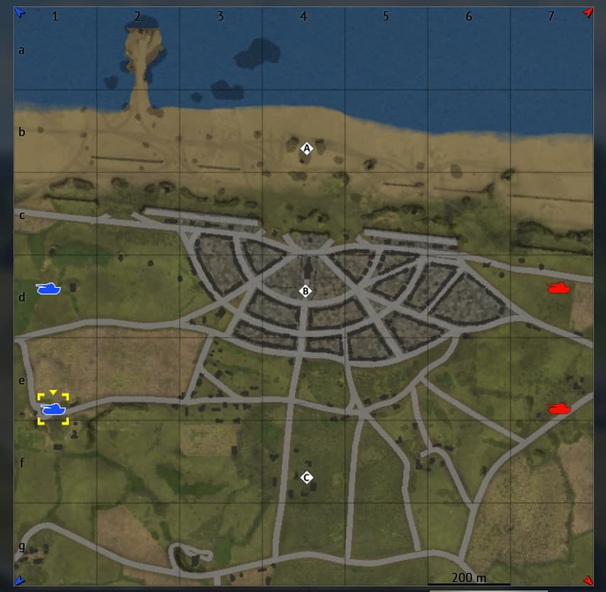

| Cell type | Cover | Movement penalty | Description                   |
|-----------|-------|-----------------|-------------------------------|
| OPEN      | 0.0   | 0               | Open terrain with no cover    |
| BUSH      | 0.3   | 1               | Bushes, light cover           |
| FOREST    | 0.6   | 2               | Forest, moderate cover        |
| RUBBLE    | 0.5   | 1               | Debris, good cover            |
| WALL      | 0.9   | 3               | Wall, high cover              |
| WATER     | 0.0   | 99              | Water, impassable             |

### Points of Interest

| Point | Strategic Value | Notes                                            |
|-------|-----------------|--------------------------------------------------|
| A     | Medium          | Allows supply collection (limit: 1000 fuel, 50 ammo) |
| B     | High            | The most valuable due to its central position    |
| C     | Medium          | Same as A                                        |

### Platoons

| Team           | Platoons | Tanks/Platoon | HP/Platoon | Image                                    |
|----------------|----------|---------------|------------|------------------------------------------|
| Blue (Tigers)  | 4        | 6             | 650        | 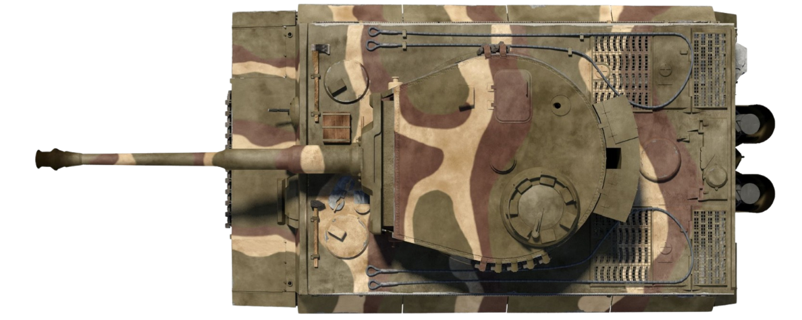            |
| Red (Shermans) | 12 (3:1) | 5             | 500        | 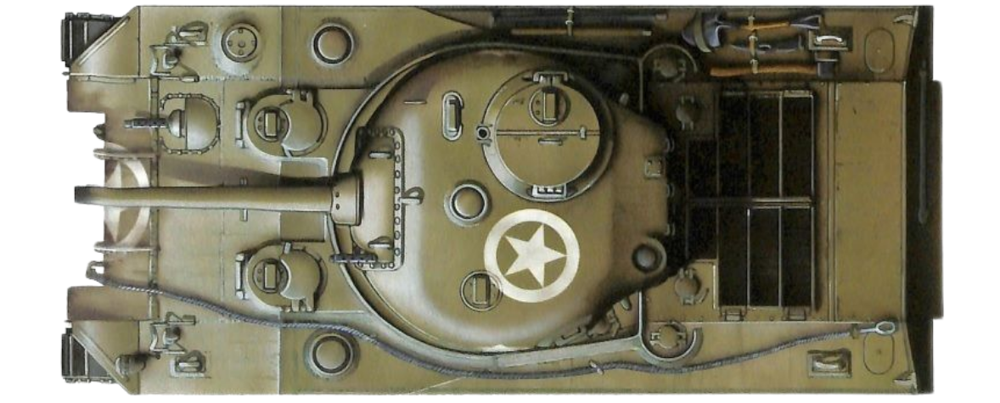        |
| LF (Luftwaffe) | 1        | 1             | N/A        | 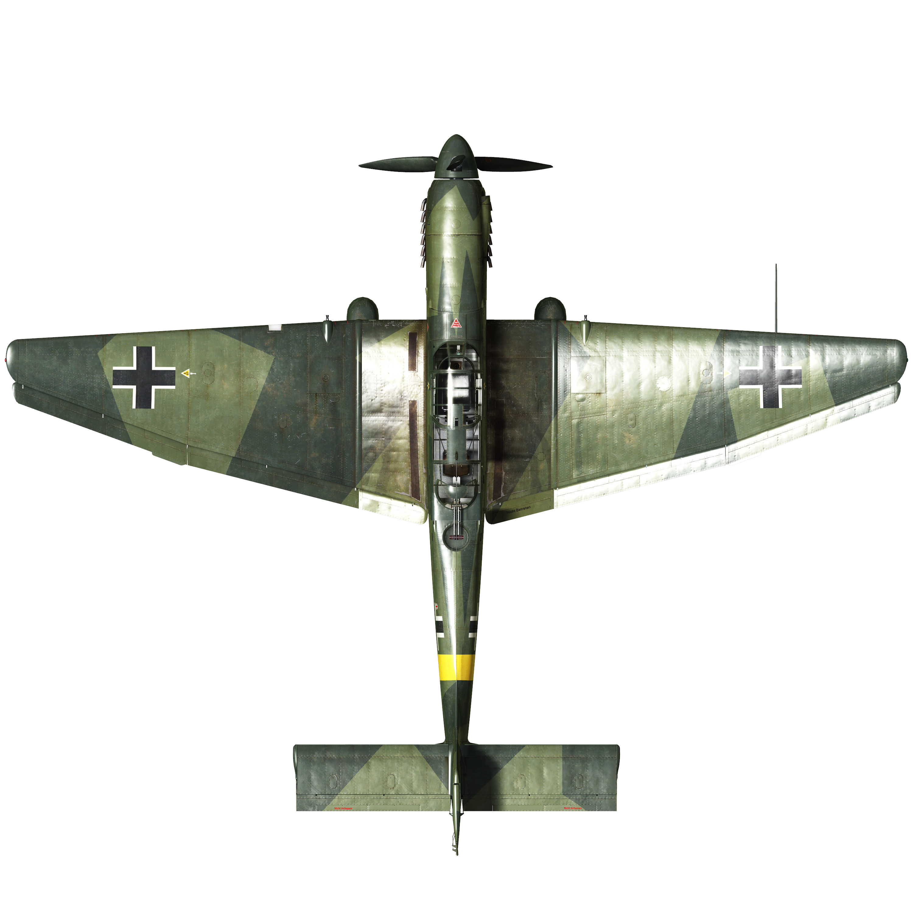         |

When HP drops below 100, a tank is destroyed and the platoon's firepower decreases proportionally.

### Commander Meta-Actions (per platoon)

| Meta-Action   | Code | Delegated Sub-Agent                            |
|---------------|------|------------------------------------------------|
| META_CAPTURE  | 0    | Capture Agent – Moves toward the objective     |
| META_ATTACK   | 1    | Attack Agent – Decides whether to fire         |
| META_DEFENSE  | 2    | Defense Agent – Seeks cover                    |
| META_RESUPPLY | 3    | Resupply – Directly at supply point            |

### Observation Vector (per platoon)

Each platoon receives a vector of 16 integer values in the range [0–9]:

| Index | Name         | Range | Description                                           |
|-------|--------------|-------|-------------------------------------------------------|
| 0     | hp_hundreds  | 0–5   | Platoon HP in hundreds                                |
| 1     | fuel_level   | 0–5   | Fuel level (fuel // 20)                               |
| 2     | ammo_level   | 0–5   | Ammunition level (ammo // 20)                         |
| 3     | num_tanks    | 0–5   | Remaining operational tanks                           |
| 4     | cover_type   | 0–2   | Type of cover in the current cell                     |
| 5     | enemy_nearby | 0–1   | Enemy within ≤ 12 cells (ENEMY_NEARBY_RANGE)          |
| 6     | enemy_dist   | 0–9   | Distance to the nearest enemy                         |
| 7     | captured_A   | 0–1   | Point A captured by blue                              |
| 8     | captured_B   | 0–1   | Point B captured by blue                              |
| 9     | captured_C   | 0–1   | Point C captured by blue                              |
| 10    | obj_dx_dir   | 0–2   | X direction to the objective (0 = same, 1 = right, 2 = left) |
| 11    | obj_dy_dir   | 0–2   | Y direction to the objective (0 = same, 1 = down, 2 = up) |
| 12    | obj_dist     | 0–9   | Manhattan distance to the objective                   |
| 13    | sector_x     | 0–4   | Map sector in X (pos // 5)                            |
| 14    | sector_y     | 0–4   | Map sector in Y (pos // 5)                            |
| 15    | low_ammo     | 0–1   | Critical ammo flag (< 20)                             |

### Sub-Agent Actions

**Capture Agent:**

| Action     | Code | Description          |
|------------|------|----------------------|
| MOVE_UP    | 0    | Move up (north)      |
| MOVE_DOWN  | 1    | Move down (south)    |
| MOVE_LEFT  | 2    | Move left (west)     |
| MOVE_RIGHT | 3    | Move right (east)    |
| STAY       | 4    | Stay in place        |

**Attack Agent:**

| Action     | Code | Description                           |
|------------|------|---------------------------------------|
| DONT_SHOOT | 0    | Do not fire                           |
| SHOOT      | 1    | Fire at the nearest enemy in range    |

**Defense Agent:**

| Action     | Code | Description                                 |
|------------|------|---------------------------------------------|
| DONT_COVER | 0    | Stay in current position                    |
| TAKE_COVER | 1    | Move to the best adjacent covered cell      |

---

## Gymnasium Wrappers

Wrappers allow us to add functionality to the base environment without modifying its code. They are stacked in layers on top of the environment, so that each one transforms observations, actions, or metrics before they reach the agent or the training loop.

We have used the following:
- **FogOfWarWrapper:** Hides enemies beyond 12 cells (ENEMY_NEARBY_RANGE). Simulates the historical fog of war.
- **ActionMaskWrapper:** Prevents invalid actions (attacking without ammo, resupplying outside supply points). Automatically redirects to META_CAPTURE.
- **TimeLimit:** Limits each episode to a maximum number of steps (default: 800).
- **EpisodeStatsWrapper:** Sliding window over the last 100 episodes — average reward, average steps, and average captures.
- **ObsNormWrapper:** Normalizes the observation vector to [0, 1]. Available but not currently applied in `make_env` (reserved for future neural network policies).

---

## Installation

**Requirements:**
- Python 3.10 or higher
- pip

**Steps:**
1. Clone repository
2. (Recommended) Create a virtual environment
3. Install dependencies

**Main dependencies:** `gymnasium`, `pygame`, `numpy`, `matplotlib`, `pyswarm`

**Optional (for LLM Field Marshal):** `smolagents`, `huggingface_hub`

If `smolagents` is not installed the simulation runs normally using the rule-based Field Marshal fallback — no API key required.

**API keys (optional):** Set the following environment variables before running to enable the LLM Field Marshal:
```bash
# Windows PowerShell
$env:GROQ_API_KEY = "your_groq_key_here"
$env:HF_TOKEN     = "your_hf_token_here"

# Linux / macOS
export GROQ_API_KEY="your_groq_key_here"
export HF_TOKEN="your_hf_token_here"
```

---

## Usage

### Training with Pygame Visualization

To enable rendering, instantiate the environment with `render_mode = "human"` in `training_and_eval.py`.
The environment only renders every `render_every` episodes (configurable in `env/env_config.py`) so as not to reduce training speed.
When a platoon is hit, an animated explosion visual effect is displayed over its position (orange → red → white, lasting 4 frames).

---

## Results

**Terminal output during training:**


**Render image:**

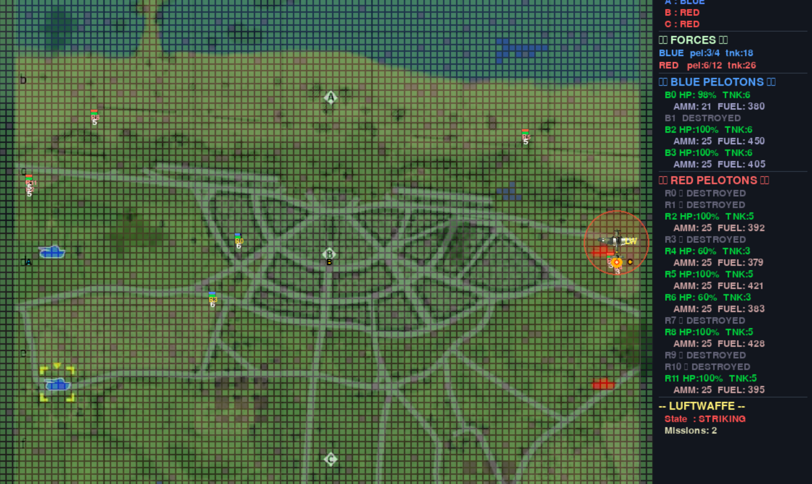

**LLM interaction**

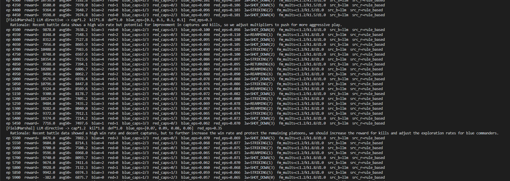


**Training Performance:**

Displays the total reward per episode (light blue) along with its 50-episode moving average (dark blue), the episode length in steps, and the commander agent's TD error. It can be observed that episodes shorten rapidly during the first 250 episodes, indicating that the agents learn to end the game efficiently.

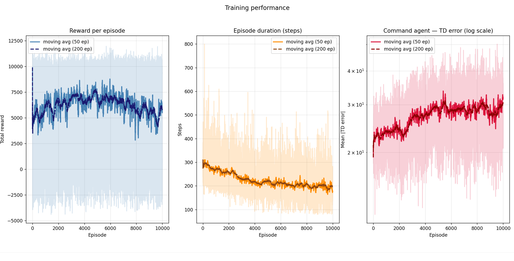

**How we interpret convergence in this project (important):**

We check practical convergence, not perfect flat curves:
- stable moving averages (short and long windows),
- stable episode length band,
- policy maps that stop changing drastically.

In our setup, some oscillation is normal because both teams keep learning and the Field Marshal periodically adjusts exploration and priorities.

**Epsilon Decay – Exploration vs Exploitation:**

Evolution of epsilon for each type of agent throughout training. In this project, epsilon is not only decayed; it is also adjusted by the Field Marshal at each strategy update. So a saw-tooth pattern is normal: decay phase -> FM adjustment -> decay phase.

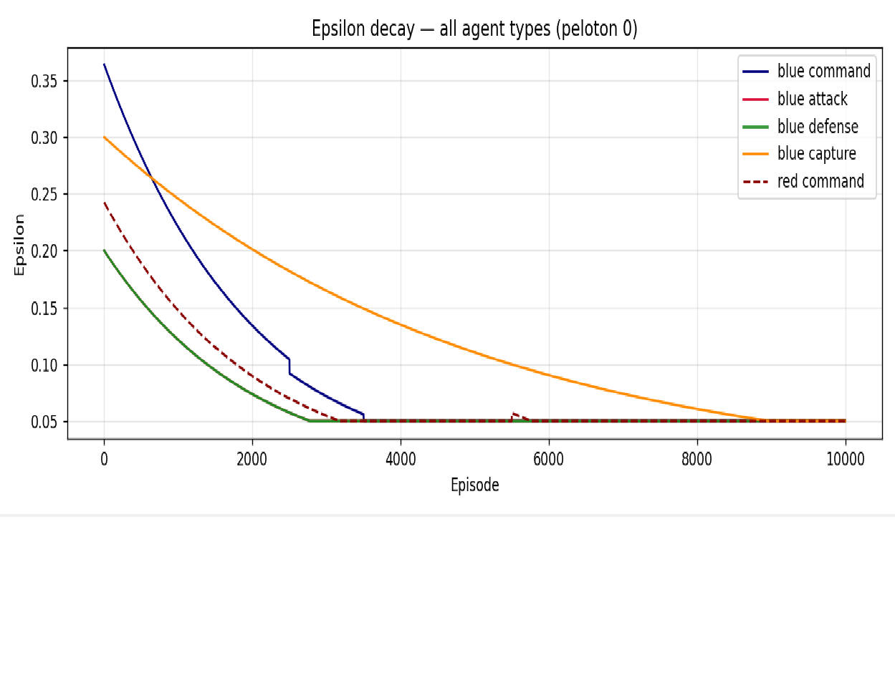

**Win rate and captures per episode:**

Training results showing the evolution of team win rates and objective captures across 10,000 reinforcement learning episodes. The graphs highlight how agents progressively improve battlefield performance, strategy adaptation, and mission control over time.

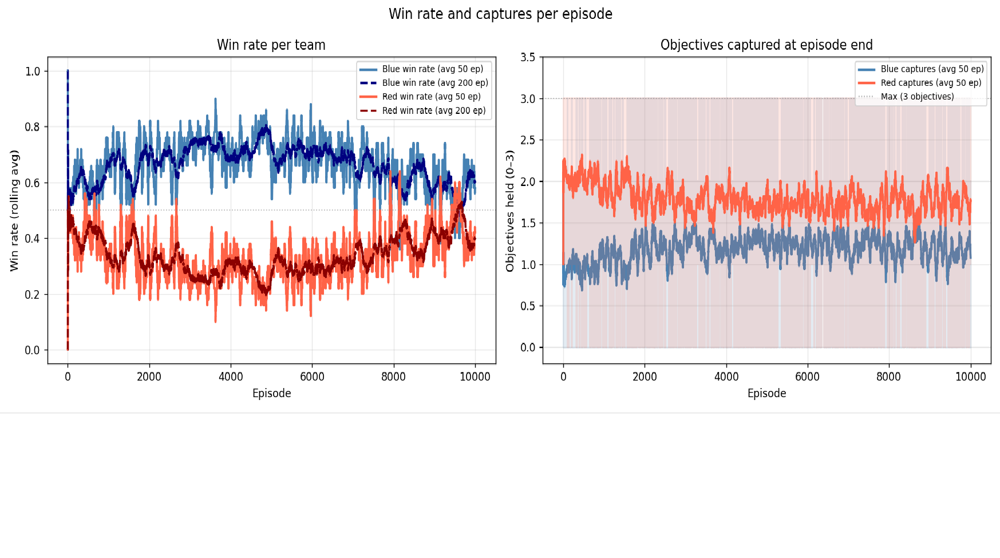

**Attack and Defense Agents – Q-values and Policy:**

The attack agent correctly learns to fire when enemies are within range.
The defense agent learns to seek cover when enemies are nearby and to remain stationary when already in high cover (Wall).

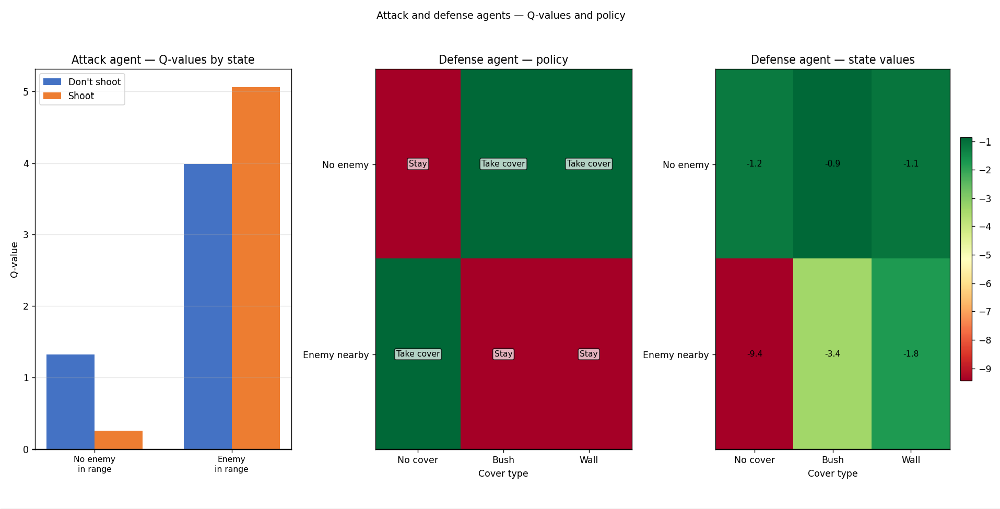

**Capture Agent – Policy and State Values:**

At short distances, state values are positive, while at longer distances negative values increase, reflecting the penalty for moving away from the objective.

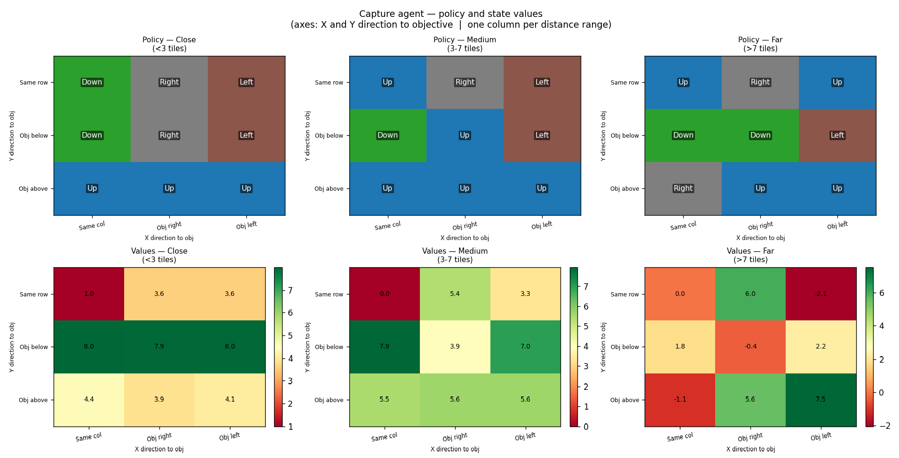

**Commander Agent – Policy and State Values:**

With normal ammunition and enemies within range, the agent learns to attack when HP is high and to resupply when it is low.
With low ammunition, it always prioritizes capturing regardless of the threat.

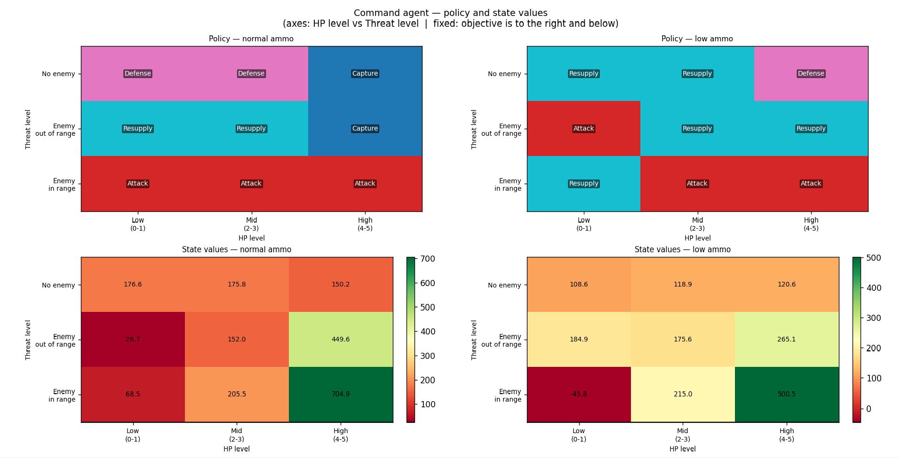

The plots are automatically generated at the end of training using `metrics_and_plotter.py`, which logs per episode the total reward, duration, TD error, captures, and the epsilon of each type of agent, and saves them in the folder configured in `env_config.py` (`PLOTS_SAVE_PATH`).

---

## Future Work (ideas)

- **Supply truck:** Implement a supply truck controlled directly by the Field Marshal (LLM), autonomously managing dynamic resupply of platoons based on the current state of the battlefield.
- **Map expansion:** Further scale the grid beyond 100×100 to accommodate new air and ground units, with procedural generation adapted to the new dimensions.
- **Render improvements:** Enhance the Pygame interface with HP indicators over sprites, a real-time statistics panel, persistent smoke effects and per-agent status visualization.
- **Neural network policy:** Replace tabular Q-Learning with a DQN or PPO policy for the commander agents, using the existing `ObsNormWrapper` for input normalisation.

---

## Authors

| Name                 | GitHub          |
|----------------------|-----------------|
| Alejandro Rodriguez  | @alejandror5803 |
| Marco Antonio Benali | @marcobenali    |
| Gaspar Muñoz         | @GasparMJ       |
