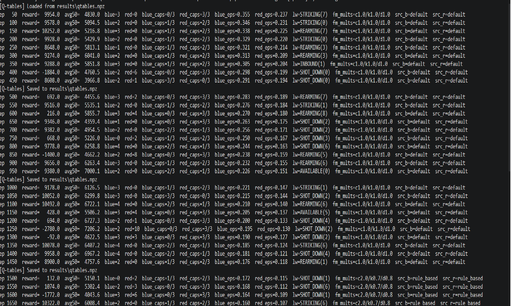
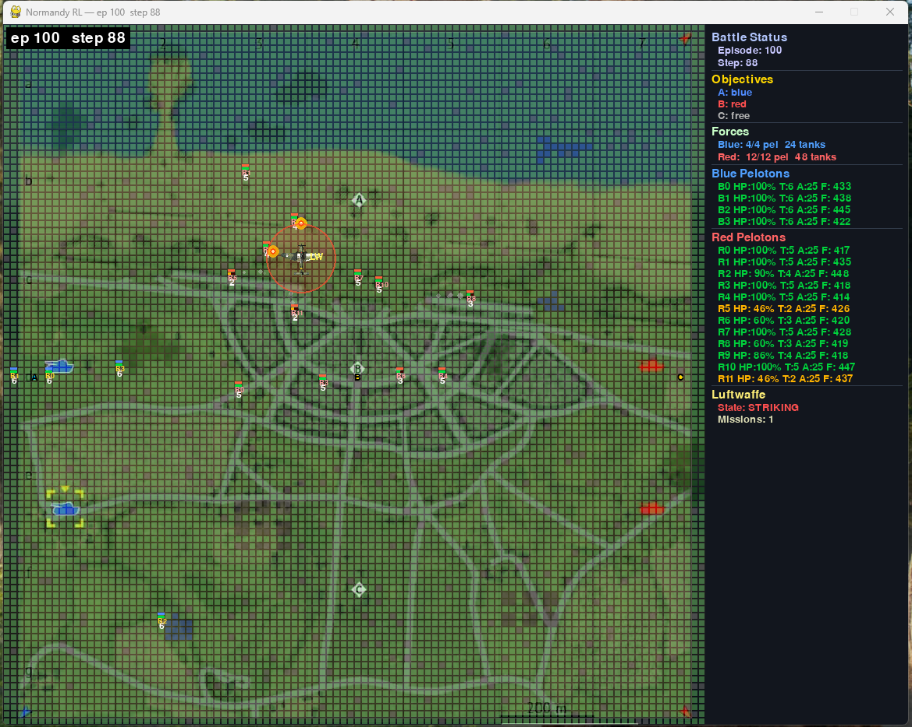
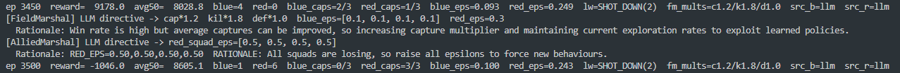
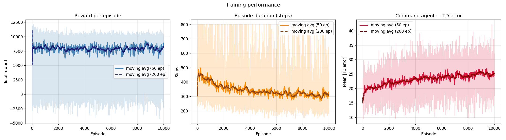
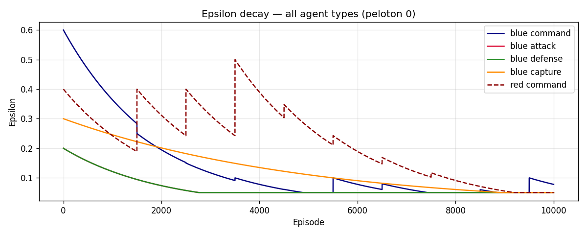
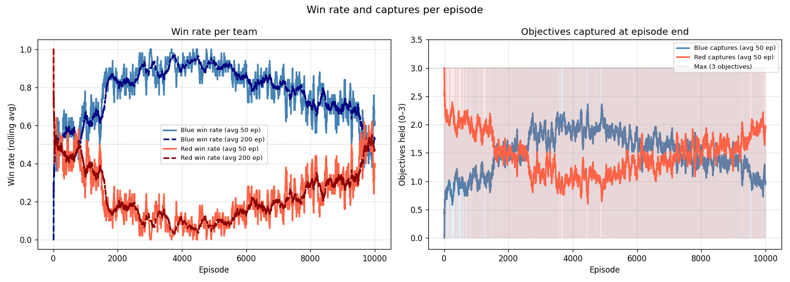
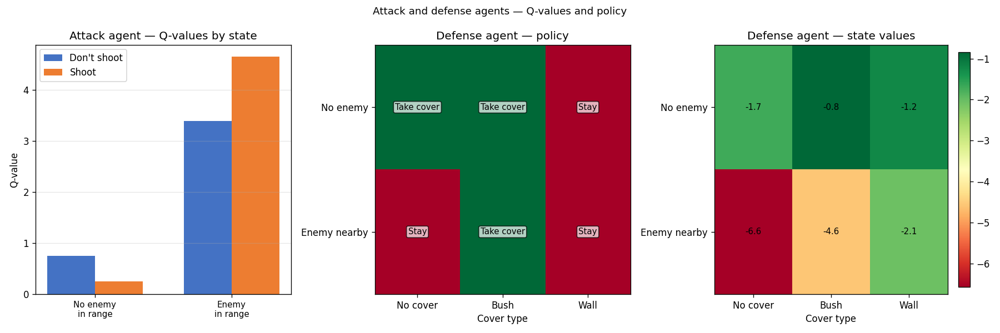
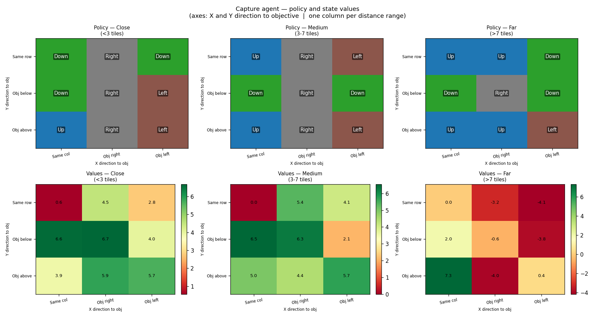
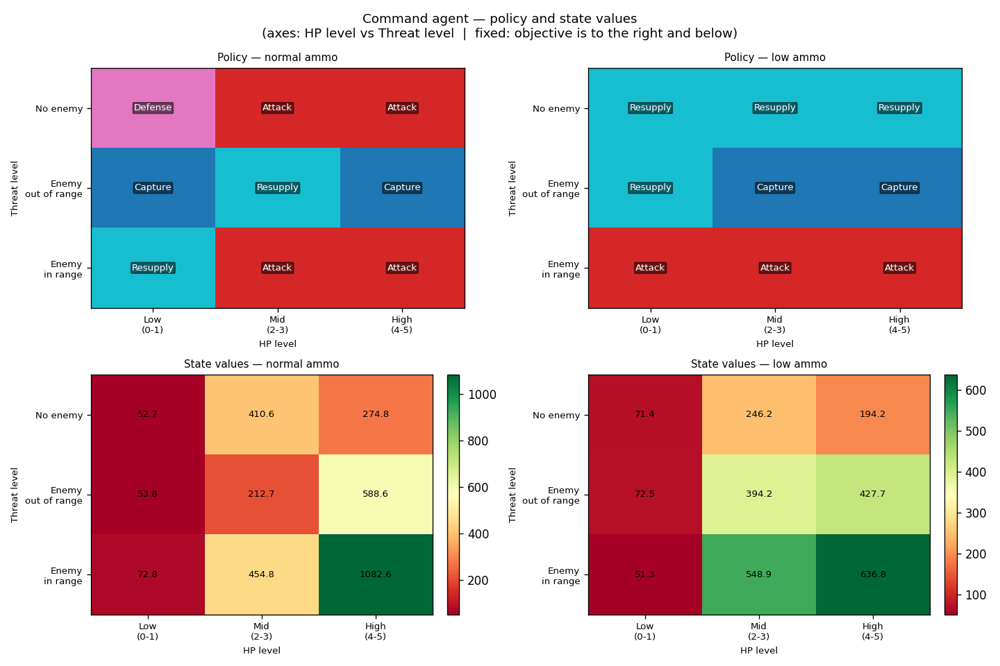

# IA-Normandy – Normandy Battle Simulation with RL

Artificial Intelligence course project. Multi-agent tactical simulation of the Battle of Normandy implemented using Gymnasium and tabular Q-Learning.

Link: [https://github.com/alejandror5803/IA-normandy-simulation-RL](https://github.com/alejandror5803/IA-normandy-simulation-RL)

---

## Table of Contents

- Description
- Important Note on Convergence
- Multi-Agent Architecture
- New AI Implementations
  - Luftwaffe Air Support (Markov Chain + PSO)
  - Field Marshal — Strategic Advisor (smolagents)
- Project Structure
- Environment
- Gymnasium Wrappers
- Installation
- Usage
- Results
- Authors

---

## Description

IA-Normandy is a tactical simulation of the Battle of Normandy (and later the Battle of Caen) in a 2D grid environment of 100×100 cells. The project models a historically accurate numerical imbalance: the blue team (Germans, Tigers) starts at a 1:3 disadvantage against the red team (Allies, Shermans), but compensates with greater armor and firepower per unit.

The objectives of the blue team are:

- Capture and hold points of interest A, B, and C (with B being the most strategically valuable).
- Engage the enemy while taking advantage of terrain cover.

Learning is carried out using tabular Q-Learning, with a hierarchical structure of agents that make decisions at different levels of abstraction.

---

## Important Note on Convergence

This is a multi-agent self-play setup with ~64 learning components (commanders + sub-agents from both teams), plus two Field Marshals that periodically change strategy, and a dynamic Luftwaffe unit. So the environment is non-stationary by design.

Because of that, we should not expect a perfect smooth single-agent convergence curve.  
In this project, we use **practical convergence**:

- moving averages stabilize in a range (not necessarily at one flat value),
- episode length reaches a stable band,
- learned policies become consistent in the policy plots.

Epsilon can look like a saw-tooth and this is expected here: it decays normally, then the Field Marshal updates it (up or down), then decay continues again.

So, oscillation by itself is not a bug in this architecture. The real check is whether long-window behavior is stable and coherent.

---

## Multi-Agent Architecture

The system is organized into two hierarchical levels:

- **Commander Agent:** Coordinates the platoon's sub-agents. Selects which sub-agent takes control each step.
- **Attack Agent:** Decides whether to attack the nearest enemy within its observation range. It is penalized if an enemy is present and it does not fire; it is rewarded for each successful hit.
- **Capture Agent:** Moves the platoon toward the designated objective. It is rewarded for getting closer and penalized for moving away.
- **Defense Agent:** When the commander picks META_DEFENSE, this agent decides whether to stay put or move to a neighbouring cell with better cover (bushes, forest, walls).
- **Luftwaffe Agent:** German air support unit that operates independently of the ground platoons. See dedicated section below.
- **Field Marshal (×2):** One LLM-based strategic advisor per team. See dedicated section below.

---

## New AI Implementations

### Luftwaffe Air Support — `agents/luftwaffe_agent.py`

The Luftwaffe adds a German JU-87 Stuka that performs bombing runs on Allied platoons. Its logic combines two AI techniques covered in class.

#### 1. Markov Chain — Operational lifecycle

The aircraft's lifecycle is modelled as a discrete Markov Chain with 6 states:


| State     | Code | Description                          |
| --------- | ---- | ------------------------------------ |
| AVAILABLE | AV   | Waiting at base, ready for a mission |
| INBOUND   | IB   | Flying toward the target             |
| STRIKING  | ST   | Executing the bomb run (1 step)      |
| RETURNING | RT   | Flying back to base                  |
| REARMING  | RA   | Reloading at base                    |
| SHOT_DOWN | SD   | Absorbing state — aircraft destroyed |


The transition matrix `T` captures the probabilities between states. The stochastic element is `P_FLAK = 0.04`: a 4% chance per step of being intercepted by anti-aircraft fire while in the `INBOUND` state.

Theoretical statistics computed at initialisation from the chain:


| Metric                             | Value    |
| ---------------------------------- | -------- |
| Cycle length                       | 27 steps (1+5+1+5+15; rearm is random 15–25 in `env_config`) |
| P(survive one mission)             | 81.5%    |
| Availability                       | ~3.7%    |
| Expected missions before shootdown | ~5.4     |


#### 2. Particle Swarm Optimization (PSO) — Target selection

Before each mission, `pyswarm.pso()` is used to find the map coordinate `(x, y)` that maximises expected blast damage on enemy platoons.

**Objective function** (negated because PSO minimises):

```
f(x, y) = Σ HP_enemy × (1 − cover × 0.5) × distance_factor × (tanks / 3)
```

PSO parameters: 50 particles, 40 iterations, ω=0.5, φp=1.5, φg=1.5.

The blast has a Manhattan radius of 5 cells with a linear falloff. Terrain cover and tank count are taken into account. `pyswarm`'s internal output is suppressed with stdout redirection so it does not pollute the training log.

#### Rendering

The aircraft is rendered as an animated JU-87 sprite (`resources/ju87.png`) that:

- Interpolates its position between base and target based on the current Markov Chain state and steps elapsed.
- Rotates to face the flight direction.
- Draws a semi-transparent path line to its target.
- Shows a red blast-radius crosshair on the target cell.

A configurable delay (`START_DELAY = 50 steps`) prevents the aircraft from bombing the enemy spawn before platoons have dispersed.

---

### Field Marshal — Strategic Advisor with Smolagents — `agents/field_marshal.py`

Two independent Field Marshals — one per team — act as LLM-based strategic advisors using the **smolagents** `ToolCallingAgent`. They are called every `FM_STRATEGY_INTERVAL = 1000` episodes (after a warmup of 1500 episodes) to avoid burning API quota, keeping the last directive active between calls.

If `smolagents` is not installed or the API call fails, both fall back silently to their rule-based equivalents.

#### German Field Marshal (blue team) — `SmolAgentsFieldMarshal`

**Character:** Generalfeldmarschall von Rundstedt.

**Tools provided to the LLM:**


| Tool                     | Arguments                                          | Purpose                                     |
| ------------------------ | -------------------------------------------------- | ------------------------------------------- |
| `get_battle_performance` | avg_reward, win_rate, avg_captures, blue_alive_avg | Recent performance report                   |
| `get_commander_stats`    | blue_epsilons_csv, blue_q_means_csv, red_epsilon   | Per-commander Q-table and epsilon status    |
| `get_luftwaffe_report`   | missions_done, lw_active                           | Luftwaffe mission count and aircraft status |


**LLM output format (one line):**

```
CAPTURE_MULT=1.5  KILL_MULT=0.8  DEFEND_MULT=1.0
BLUE_EPS=0.15,0.20,0.15,0.25  RED_EPS=0.35
RATIONALE=Blue is winning fights but not capping — push capture harder.
```

**Option A — Dynamic reward multipliers:**
The LLM outputs a scaling factor for each meta-action type. These are applied directly to the base environment reward in the training loop before the Bellman update:

```python
base_r = rewards[i] - cfg.P_STEP       # strip step penalty to avoid amplifying it
r = commander.compute_reward(..., reward_mult=capture_mult)
r += cfg.P_STEP                         # add back at 1×
```

A multiplier of `2.0` on captures doubles the gradient signal for capture actions in the Q-table update — much more effective than a flat reward bonus. The step penalty is deliberately excluded from scaling.

The same multipliers are also passed into `normandy_env` via `set_fm_reward_mults()` and applied when red commanders update their Q-tables (inside `step()`). So both teams feel the reshaped reward signal; only blue gets the per-commander epsilon from this FM.

**Option B — Per-commander epsilon:**
After each FM call, each blue commander's epsilon is set individually based on the LLM's assessment of its Q-table status (confident / learning / confused).


| Multiplier range | Epsilon range |
|-----------------|---------------|
| [0.5, 2.5] | [0.05, 0.70] |

---

#### Allied Field Marshal (red team) — `AlliedFieldMarshal`

**Character:** General Omar Bradley.

**Tools provided to the LLM:**

| Tool | Arguments | Purpose |
|------|-----------|---------|
| `get_allied_battle_performance` | red_win_rate, avg_red_alive, avg_blue_alive | Red team performance report |
| `get_squad_stats` | squad_epsilons_csv, squad_q_means_csv | Per-squad exploration and Q-value status |

The 12 red commanders are grouped into **4 squads of 3** (squad 0 = cmds 0–2, squad 1 = cmds 3–5, etc.) to match the 4-unit structure of the blue team.

**LLM output format:**

```
RED_EPS=0.15,0.20,0.15,0.25  RATIONALE=Squad 2 is getting wiped out — push exploration.
```

**Option B — Per-squad epsilon (red only):**
The Allied FM only adjusts exploration: four `RED_EPS` values (one per squad of 3 commanders). It does not output capture/kill/defend multipliers — those come from the German FM and already affect red learning in the env as described above.

#### Estimated API call budget

First call after warmup at episode 1500, then every 1000 episodes (`1500, 2500, 3500, …`).

| Training length | Calls (German FM) | Calls (Allied FM) | Total |
|-----------------|-------------------|-------------------|-------|
| 5 000 episodes | 4 | 4 | 8 |
| 10 000 episodes | 9 | 9 | 18 |

---

## Project Structure

```
IA-normandy-simulation-RL/
├── .gitignore
├── requirements.txt
├── training_and_eval.py            # Training loop
├── readme.md
│
├── agents/
│   ├── __init__.py
│   ├── agents_config.py            # Shared agent constants
│   ├── command_agent.py            # Commander Q-Learning agent
│   ├── attack_agent.py             # Attack sub-agent
│   ├── defense_agent.py            # Defense sub-agent
│   ├── capture_agent.py            # Capture sub-agent
│   ├── field_marshal.py            # German + Allied Field Marshal logic
│   └── luftwaffe_agent.py          # Luftwaffe (Markov Chain + PSO)
│
├── env/
│   ├── __init__.py
│   ├── env_config.py               # Main configuration constants
│   ├── normandy_env.py             # Main Gymnasium environment
│   ├── wrappers.py                 # Gymnasium wrappers
│   ├── combat_logic.py             # Distance, attack and cover helpers
│   ├── map_generator.py            # Terrain and objective map generation
│   └── units.py                    # Unit utility functions
│
├── utils/
│   ├── __init__.py
│   └── metrics_and_plotter.py      # EpisodeTracker + all plots
│
├── resources/
│   ├── ju87.png
│   ├── tiger.png
│   ├── sherman.png
│   ├── mapaNormandia.png
│   └── Estructura de la practica(inicial).png
│
├── readme_resources/               # Static images used inside README
│   ├── terminal_output.png
│   ├── render.png
│   ├── LLM.png
│   ├── LLM_interaction.png
│   ├── training_curves.png
│   ├── epsilon_decay.png
│   ├── win_rate_and_captures.png
│   ├── command_agent_policy.png
│   ├── attack_defense_policy.png
│   └── capture_agent_policy.png
│
└── results/                        # Generated at the end of training runs (gitignored)
    ├── training_curves.png
    ├── epsilon_decay.png
    ├── win_rate_and_captures.png
    ├── command_agent_policy.png
    ├── attack_defense_policy.png
    ├── capture_agent_policy.png
    └── qtables.npz
```

---

## Environment

### Map and Terrain

The environment is a 100×100 grid rendered with Pygame, using `mapaNormandia.png` as the background. The map and unit spawn positions are generated once and remain fixed across all episodes to allow Q-tables to converge to a stable policy.

Sample of the map used:


| Cell type | Cover | Movement penalty | Description                   |
|-----------|-------|-----------------|-------------------------------|
| OPEN      | 0.0   | 0               | Open terrain with no cover    |
| BUSH      | 0.3   | 1               | Bushes, light cover           |
| FOREST    | 0.6   | 2               | Forest, moderate cover        |
| RUBBLE    | 0.5   | 1               | Debris, good cover            |
| WALL      | 0.9   | 3               | Wall, high cover              |
| WATER     | 0.0   | 99              | Water, impassable             |

### Points of Interest

| Point | Strategic Value | Notes                                            |
|-------|-----------------|--------------------------------------------------|
| A     | Medium          | Allows supply collection (limit: 1000 fuel, 50 ammo) |
| B     | High            | The most valuable due to its central position    |
| C     | Medium          | Same as A                                        |

### Platoons

| Team           | Platoons | Tanks/Platoon | HP/Platoon | Image                                    |
|----------------|----------|---------------|------------|------------------------------------------|
| Blue (Tigers)  | 4        | 6             | 650        |             |
| Red (Shermans) | 12 (3:1) | 5             | 500        |         |
| LF (Luftwaffe) | 1        | 1             | N/A        |          |

When HP drops below 100, a tank is destroyed and the platoon's firepower decreases proportionally.

### Commander Meta-Actions (per platoon)

| Meta-Action   | Code | Delegated Sub-Agent                            |
|---------------|------|------------------------------------------------|
| META_CAPTURE  | 0    | Capture Agent – Moves toward the objective     |
| META_ATTACK   | 1    | Attack Agent – Decides whether to fire         |
| META_DEFENSE  | 2    | Defense Agent – Seeks cover                    |
| META_RESUPPLY | 3    | Resupply – Directly at supply point            |

### Observation Vector (per platoon)

Each platoon receives a vector of 16 numeric features (not all share the same max):

| Index | Name         | Range | Description                                           |
|-------|--------------|-------|-------------------------------------------------------|
| 0     | hp_hundreds  | 0–5   | Platoon HP in hundreds                                |
| 1     | fuel_level   | 0–25  | `fuel // 20` (full tank = 500 fuel)                   |
| 2     | ammo_level   | 0–1   | `ammo // 20` (max ammo = 25 per platoon)              |
| 3     | num_tanks    | 0–5   | Remaining operational tanks                           |
| 4     | cover_type   | 0–2   | Type of cover in the current cell                     |
| 5     | enemy_nearby | 0–1   | Enemy within ≤ 12 cells (ENEMY_NEARBY_RANGE)          |
| 6     | enemy_dist   | 0–9   | Distance to the nearest enemy                         |
| 7     | captured_A   | 0–1   | Point A captured by blue                              |
| 8     | captured_B   | 0–1   | Point B captured by blue                              |
| 9     | captured_C   | 0–1   | Point C captured by blue                              |
| 10    | obj_dx_dir   | 0–2   | X direction to the objective (0 = same, 1 = right, 2 = left) |
| 11    | obj_dy_dir   | 0–2   | Y direction to the objective (0 = same, 1 = down, 2 = up) |
| 12    | obj_dist     | 0–9   | Manhattan distance to the objective                   |
| 13    | sector_x     | 0–4   | Map sector in X (pos // 5)                            |
| 14    | sector_y     | 0–4   | Map sector in Y (pos // 5)                            |
| 15    | low_ammo     | 0–1   | Critical ammo flag (< 20)                             |

### Sub-Agent Actions

**Capture Agent:**

| Action     | Code | Description          |
|------------|------|----------------------|
| MOVE_UP    | 0    | Move up (north)      |
| MOVE_DOWN  | 1    | Move down (south)    |
| MOVE_LEFT  | 2    | Move left (west)     |
| MOVE_RIGHT | 3    | Move right (east)    |
| STAY       | 4    | Stay in place        |

**Attack Agent:**

| Action     | Code | Description                           |
|------------|------|---------------------------------------|
| DONT_SHOOT | 0    | Do not fire                           |
| SHOOT      | 1    | Fire at the nearest enemy in range    |

**Defense Agent:**

| Action     | Code | Description                                 |
|------------|------|---------------------------------------------|
| DONT_COVER | 0    | Stay in current position                    |
| TAKE_COVER | 1    | Move to the best adjacent covered cell      |

---

## Gymnasium Wrappers

Wrappers allow us to add functionality to the base environment without modifying its code. They are stacked in layers on top of the environment, so that each one transforms observations, actions, or metrics before they reach the agent or the training loop.

We have used the following:

- **FogOfWarWrapper:** Hides enemies beyond 12 cells (ENEMY_NEARBY_RANGE). Simulates the historical fog of war.
- **ActionMaskWrapper:** Prevents invalid actions (attacking without ammo, resupplying outside supply points). Automatically redirects to META_CAPTURE.
- **TimeLimit:** Limits each episode to a maximum number of steps (default: 800).
- **EpisodeStatsWrapper:** Sliding window over the last 100 episodes — average reward, average steps, and average captures.
- **ObsNormWrapper:** Normalizes the observation vector to [0, 1]. Available but not currently applied in `make_env` (reserved for future neural network policies).

---

## Installation

**Requirements:**

- Python 3.10 or higher
- pip

**Steps:**

1. Clone the repository and open a terminal in the project folder.

2. (Recommended) Create and activate a virtual environment:

```bash
python -m venv .venv

# Windows (PowerShell)
.\.venv\Scripts\Activate.ps1

# Linux / macOS
source .venv/bin/activate
```

3. Install dependencies:

```bash
pip install -r requirements.txt
```

**Main dependencies:** `gymnasium`, `pygame`, `numpy`, `matplotlib`, `pyswarm`

**Optional (for LLM Field Marshal):** `smolagents`, `huggingface_hub`

If `smolagents` is not installed the simulation runs normally using the rule-based Field Marshal fallback — no API key required.

**API keys (optional):** Set the following environment variables before running to enable the LLM Field Marshal:

```bash
# Windows PowerShell
$env:GROQ_API_KEY = "your_groq_key_here"
$env:HF_TOKEN     = "your_hf_token_here"

# Linux / macOS
export GROQ_API_KEY="your_groq_key_here"
export HF_TOKEN="your_hf_token_here"
```

---

## Usage

### Training

From the project root (with the venv active if you use one):

```bash
python training_and_eval.py
```

By default this runs **10 000 episodes** with Pygame rendering (`render_mode = "human"` in `training_and_eval.py`). The window only updates every `render_every` episodes (see `RENDER_EVERY` in `env/env_config.py`, and the call at the bottom of `training_and_eval.py`) so training does not slow down too much.

Checkpoints and plots are written under `results/` (`qtables.npz` plus the PNG curves). To start from scratch instead of loading a previous checkpoint, change `resume=False` in the `train(...)` call at the end of `training_and_eval.py`.

When a platoon is hit, an explosion effect is shown on screen (orange -> red -> white, 4 frames).

To train **without** opening a window, set `render_mode=None` in the `make_env(...)` call inside `train()`.

---

## Results

**Terminal output during training:**



**Render image:**



**LLM interaction:**




---

**Training Performance:**

The reward starts negative during early exploration, rises to a peak of around 8,500–9,000 by episode 4,000–5,000, and then gradually falls to around 6,000–7,000 in the second half of training. This arc shape is not a failure; it reflects the coevolutionary arms race: blue learned a dominant strategy, the Field Marshal pushed red to explore harder, and red found a counter. Episode duration decreases consistently from ~300 to ~200 steps, meaning both teams resolve encounters faster as they learn. The TD error shows clear stepped jumps at episodes ~2,500 and ~5,500, which coincide exactly with Field Marshal interventions that raised red's epsilon and forced the Q-tables to re-evaluate previously stable states.



**How we interpret convergence in this project (important):**

We check practical convergence, not perfect flat curves:
- stable moving averages (short and long windows),
- stable episode length band,
- policy maps that stop changing drastically.

In our setup, some oscillation is expected because both teams keep learning simultaneously and the Field Marshal periodically adjusts exploration rates and reward priorities.

---

**Epsilon Decay – Exploration vs Exploitation:**

Here you can see what the Field Marshal actually does. The red team's epsilon was raised multiple times throughout training; at episodes ~1,500, ~2,500, ~3,500, ~5,000, and ~5,500; peaking as high as 0.5 on one intervention. Each of these resets corresponds to the Allied Field Marshal detecting that red was stagnating and forcing it to try new tactics. Blue's epsilon was also reset twice, visible as the two small steps in the blue command curve. The capture agent (orange) is the slowest to converge, reaching the minimum only around episode 9,000, which makes sense given that navigation across a 100×100 map involves far more state space than attack or defense decisions.



---

**Win Rate and Captures per Episode:**

Blue peaks at 80–90% win rate around episodes 2,000–4,000. From that point it falls progressively to ~50–60% by episode 10,000 as red adapts. This is the clearest coevolutionary dynamic in the project: blue finds a dominant strategy, the Allied Field Marshal raises red's exploration until red finds a counter, and the win rate converges toward a competitive equilibrium. The captures graph shows a similar story; red initially controls all three objectives in the first episodes while blue is still exploring, then blue catches up to ~1.5 objectives per episode, and both teams stabilize around 1.5 by the end.



---

**Attack and Defense Agents – Q-values and Policy:**

The attack agent has learned the correct behaviour: when no enemy is in range, Don't shoot is clearly preferred (Q = 0.8 vs 0.3 for Shoot). When an enemy is in range, Shoot wins by a large margin (Q = 4.6 vs 3.4). The separation between the two states is the highest recorded, showing that the agent has built a well-differentiated Q-table.

The defense agent has also learned a reasonable policy. When there is no enemy nearby and no cover, it seeks cover opportunistically (Take cover). When it already has Bush or Wall protection, it stays put to avoid wasting fuel. When an enemy is nearby and it is already behind a Wall, it stays, correctly judging that moving would expose it. All state values are negative, which is expected: defense never earns direct positive rewards, it only reduces damage taken.



---

**Capture Agent – Policy and State Values:**

At close and medium distances the policy is coherent: the agent moves Up when the objective is above, Down when it is below, Right when it is to the right, and Left when it is to the left. State values are positive in these ranges (1–7), indicating that the agent has learned that moving toward the objective is genuinely worthwhile. At far distances (>7 tiles) the policy becomes noisier and some values turn negative, which is expected, the agent visits those long-range states less frequently during training and has less opportunity to refine them.



---

**Commander Agent – Policy and State Values:**

The command agent shows its richest Q-table, with a maximum state value of 1,082 (enemy in range, high HP, normal ammo), roughly double the values seen in earlier checkpoints, indicating much deeper learning.

With normal ammo, the policy is tactically coherent: Attack when HP is mid or high and an enemy is in range, Resupply when HP is low and an enemy is in range (prioritising survival over fighting), and Capture or Resupply when there is no threat. With low ammo, the policy shifts cleanly toward Attack when an enemy is present and Resupply otherwise, the agent learned that conserving ammo matters and that running dry in a firefight is dangerous. The state value gradient is clear in both heatmaps: values increase from bottom-left (low HP, no threat) to top-right (high HP, enemy in range), which is exactly the expected pattern for an offensive unit.



---

The plots are automatically generated at the end of training using `metrics_and_plotter.py`, which logs per episode the total reward, duration, TD error, captures, and the epsilon of each agent type, and saves them in the folder configured in `env_config.py` (`PLOTS_SAVE_PATH`).

---

## Authors


| Name                 | GitHub          |
| -------------------- | --------------- |
| Alejandro Rodriguez  | @alejandror5803 |
| Marco Antonio Benali | @marcobenali    |
| Gaspar Muñoz         | @GasparMJ       |
